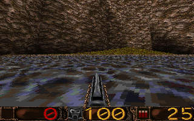
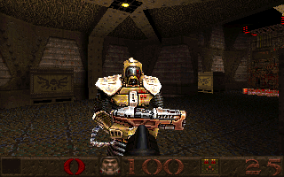
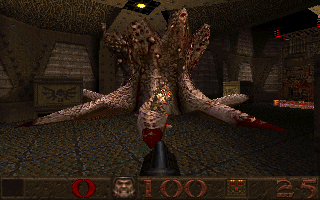
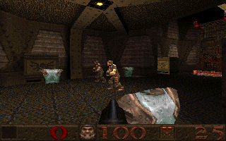
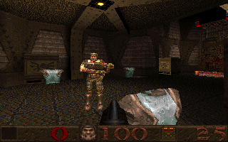

# Firebird Quake

Quake, simulated and rendered inside the [Firebird](https://firebirdsql.org) SQL database, running
entirely in your browser on Firebird 6 compiled to WebAssembly. A port of the idea behind
[Firebird DOOM](https://github.com/mariuz/firebird-doom) to a true 3D engine.

**Play it:** https://mariuz.github.io/firebird-quake/

The series went on: [Firebird Quake 2](https://github.com/mariuz/firebird-quake2) ([play](https://mariuz.github.io/firebird-quake2/)) and [Firebird Quake III Arena](https://github.com/mariuz/firebird-quake3) ([play](https://mariuz.github.io/firebird-quake3/)), with Bézier patches, MD3 player models and deathmatch bots that think in SQL.

   

More pictures, of every level of the first two episodes, the start of the third and the registered
monsters, with the commands that made them, are in [docs/screenshots.md](docs/screenshots.md). The
long account of how it is built is [docs/ARCHITECTURE.md](docs/ARCHITECTURE.md); what is still
missing is [docs/ROADMAP.md](docs/ROADMAP.md).

Every game tic is a PSQL procedure call. Every frame is a `SELECT`. JavaScript handles the keyboard,
the mouse and the canvas; everything else — collision against the BSP hulls, the player's physics,
doors, platforms, triggers, items, weapons, damage, the monster AI, and the visibility and projection of
every polygon on screen — happens in SQL.

```
keyboard/mouse → SELECT * FROM quake_tic(...)      game logic: 20 Hz, PSQL
               → SELECT * FROM frame_faces_fast    the faces on screen this frame (SQL picks, JS projects)
               → SELECT * FROM frame_ents          alias models and sprites in the PVS, with their pose
               → SELECT * FROM frame_lightstyles   this frame's light animation
               → SELECT ... FROM sound_events      what to play, and where
               → JS rasterises polygons and models through the colormap → canvas
```

## Running it

```bash
npm install
npm run fetch-pak      # downloads the Quake shareware episode (quake106.zip) and extracts id1/pak0.pak
npm run serve          # http://localhost:8080/ — add --coi if your browser blocks service workers
```

`fetch-pak` needs a tool that can read the LHA archive inside the shareware zip: 7-Zip, `lha` or
`lhasa` (`sudo apt-get install lhasa` on Debian/Ubuntu). If you own Quake, copy your `pak0.pak` with
`PAK=/path/to/pak0.pak npm run fetch-pak` and put `pak1.pak` beside it in `public/pak/`, or pick the
two files together in the page's file picker. With `pak1.pak` loaded the page offers the other three
episodes and the registered monsters (enforcer, hell knight, vore, spawn, rotfish, Shub-Niggurath), and
the screenshot tool can draw them.

### LibreQuake

[LibreQuake](https://github.com/lavenderdotpet/LibreQuake) is free game data for the Quake engine
(BSD-3-licensed models, textures, sounds and maps that keep Quake's file layout). The page and the
tools take it as an alternative to the shareware episode, and its `pak1.pak` as a free stand-in for
the registered one:

```bash
npm run fetch-librequake   # downloads LibreQuake lite (v0.09-beta, 56 MB) into public/pak/lq1/pak0.pak and pak1.pak
```

The page's **Data** selector then offers *LibreQuake* (its own levels, `lq_e0m1` onwards, with its
monsters and weapons) and *Quake shareware + LibreQuake monsters*: the shareware episode with
LibreQuake's `pak1.pak` beside it, which gives the enforcer, hell knight, vore, spawn, rotfish and
Shub-Niggurath models and sounds without the registered data. The deployed site serves both.

LibreQuake's models carry no frame names, only numbers, while the game picks animations by name
(`run`, `pain`, `death`…). They keep Quake's frame order, since `progs.dat` addresses frames by
number, so the loader applies the id models' frame layouts (`src/framelayouts.js`, generated by
`npm run gen-frame-layouts` from a pak with named frames) to any model whose frames are unnamed.
LibreQuake's own `progs.dat` runs too, in QuakeC mode (the **Logic** setting): FTEQCC overlaps the
locals of its functions, which the VM saves and restores around their calls as Quake's does.

  

Firebird WASM uses pthreads, so the page must be cross-origin isolated. The dev server sends the
COOP/COEP headers with `--coi`; a static host like GitHub Pages cannot, so `coi-serviceworker.js`
re-issues responses with the headers after a one-time reload. Node 20 or later is required for the
scripts.

### Playing

Click the view to capture the mouse.

| keys | |
|---|---|
| `W` `A` `S` `D` or the arrows | move (always running; `Shift` walks) |
| mouse, `PgUp`/`PgDn` | look |
| `Ctrl`, `F` or click | fire |
| `Space` or `E` | jump, or swim up |
| `1`–`8`, `/` or the wheel | choose a weapon, cycle weapons |
| `9` | all weapons and ammo (impulse 9) |
| `P` | pause |
| `Esc` | Quake's menu: new game, options (mouse speed, always run, volumes, screen size…), help |

On touch screens the left half of the view moves, the right half looks, and a tap fires.

The page's settings: the **map** (every `.bsp` in the pak), the **skill**, the **detail**
(320×200 or 160×100), the **renderer** mode (below), the sound volume and the **music**. Quake's
music was CD audio and is not in the pak: put `track02.ogg`…`track11.ogg` (or `.mp3`) in
`public/music/`, or pick that folder in the page, and each map plays its `worldspawn` track; without
them a synthesised drone fills in, or turn it off.

### The SQL console

The page has a console onto the live game database. Everything is a table, so everything can be read
or changed while playing:

```sql
SELECT * FROM player;
SELECT id, mtype, st, health, enemy_id FROM ents WHERE mtype IS NOT NULL ORDER BY st;
SELECT classname, COUNT(*) FROM ents GROUP BY classname ORDER BY 2 DESC;
SELECT FIRST 40 * FROM frame_faces_fast;          -- what the painter is about to draw
EXECUTE PROCEDURE player_impulse(9);              -- all weapons
SELECT * FROM spawn_monster('shambler', 300);     -- one, 300 units ahead
UPDATE ents SET health = 1 WHERE mtype IS NOT NULL AND health > 0;
UPDATE ents SET flags = BIN_OR(flags, 64) WHERE classname = 'player';   -- god mode
```

`window.quake` exposes the database, the renderer, the audio and the settings to the browser's own
console as well.

## How it works

### The BSP becomes tables (`sql/schema.sql`, `src/loader.js`)

A BSP file is a relational database in disguise. `loader.js` parses it (`src/bsp.js`) and copies it in,
denormalised so the hot loops never need a second lookup:

| table | from |
|---|---|
| `faces` | FACES + PLANES (flipped for `side`) + TEXINFO, plus a bounding sphere |
| `face_verts` | EDGES and SURFEDGES resolved to an ordered vertex list per face |
| `leaves` | LEAVES with the PVS decompressed to a hex string (leaf *j* visible ⇔ bit *j−1*) |
| `marksurfaces`, `hulls` | MARKSURFACES; NODES (hull 0) and CLIPNODES (hulls 1 and 2), planes copied in |
| `models`, `anims` | the world, its submodels (`*N`), the `b_*.bsp` boxes, every `.mdl` with its frame runs |
| `map_ents` | the entity lump, which `SPAWN_MAP_ENTS` turns into rows of `ents` |

`ents` is the edict table: one wide row per entity with its origin, velocity, angles, bounding box,
model, frame, health, flags, think time, movement state and targets — the fields of `entvars_t`.

The WASM build binds parameters as text, so each table has a generated `LOAD_<table>` procedure that
parses 30 KB chunks of `|`-separated lines in PSQL — about 2.5× faster than a block of `INSERT`s.
E1M1 (70 k rows) loads in about two seconds.

### Collision is a recursive procedure (`sql/physics.sql`)

`RHC` is `SV_RecursiveHullCheck`: it splits the segment at every plane it crosses and recurses into both
sides, threading the trace state (`allsolid`, `startsolid`, `inopen`, `inwater`, the fraction and the hit
plane) through its parameters, because PSQL procedures can call themselves. `TRACE_MOVE` picks the hull
by the moving box's size, runs it against the world and against every brush-model entity at its own
origin, and clips against monsters and the player with a Minkowski slab test. `FLY_MOVE`, `WALK_MOVE`
(with the 18-unit step), `MOVE_STEP` (monsters), `TOSS_MOVE` and `PUSH_MOVE` (doors crushing and
carrying) are sv_phys.c; the clip planes and the pushed entities live in global temporary tables
because PSQL has no arrays. A primary-key lookup costs about 4 µs in the WASM engine, so a trace is
well under a millisecond.

### The game is PSQL (`sql/game.sql`, `sql/weapons.sql`, `sql/monsters.sql`)

`QUAKE_TIC` runs the player (client.qc: water, jumping, the water jump, friction, acceleration, the
trigger and item touches, powerups, drowning), the pushers (with `SUB_CalcMove` semantics), the thinks
that are due, and the physics of everything that flies, bounces or falls. Doors link by touching boxes
and need keys; platforms, buttons, trains with path corners and secret doors move as in doors.qc and
plats.qc. Items and weapons from the axe to the thunderbolt, armour, damage momentum, gibs and backpacks
are items.qc, weapons.qc and combat.qc. The monsters run ai.qc's state machine — `FIND_TARGET`,
`MOVE_TO_GOAL`, `NEW_CHASE_DIR`, `CHECK_ATTACK` — with each monster's attacks and sounds defined in
`monster_types` and a few `CASE` branches: the grunt, dog, knight, ogre, scrag, fiend, zombie, shambler
and Chthon of the shareware episode, and the enforcer, hell knight, vore, spawn, rotfish and
Shub-Niggurath of the registered one. Per-map gravity (Ziggurat Vertigo), the level's `worldspawn`
message and type, the intermission and the finale live in `game`. Everything the simulation wants heard
is a row in `sound_events`; visual effects are rows in `fx_events`.

### A QuakeC VM (`sql/qcvm.sql`)

The game above is a rewrite of `progs.dat` in PSQL, so mods do not run. The start of the faithful route
is a QuakeC virtual machine in PSQL: `src/progs.js` loads `progs.dat` (statements, functions, global
and field definitions, strings, the global image) into tables, and `QC_CALL` is `PR_ExecuteProgram`
with one branch per opcode, the locals saved on a stack table, parameters copied into the callee's
locals, recursion for calls, entity fields as rows addressed by `OP_ADDRESS`, and forty of the
builtins (`makevectors`, `setorigin`, `spawn`, `find`, `traceline` against the loaded world, `ftos`,
`lightstyle`, the prints into `qc_log`...). It runs the shareware `progs.dat`: `qc_spawn_map` spawns
E1M1 through its 336 spawn functions in a second, and `qc_frame` runs `StartFrame` and the due
thinks, so items place themselves, monsters stand and doors link; `qc_client_connect` and
`qc_player_frame` run the player's own code, so the shotgun fires through `FireBullets` and a box of
shells is picked up through `ammo_touch`.

**QuakeC mode** (`qc_enter`) puts the original game on the engine: every edict's engine fields (origin,
velocity, angles, box, solid, movetype, flags, frame, model…) live in its `ents` row, the VM's field
access is routed there, and `qc_server_frame` is `Host_ServerFrame`: the client's friction and
acceleration, `StartFrame`, then each edict's physics by movetype (pushers on their own clock, toss
and missiles, falling monsters, the player's walk with its step), the touches delivered to QuakeC
through the same traces and pushers the PSQL game uses. A frame of E1M1 takes about 40 ms.



`node scripts/screenshot.mjs e1m1 out --qc --at=1150,1030,-250,330 --tics=4 --single --fast` renders a
QuakeC-mode frame. **In the page**, the **Logic** setting switches between the PSQL game and
**QuakeC VM (progs.dat)**: the level is spawned by progs.dat, every tic is `qc_tic`, which takes
`quake_tic`'s input and returns its row from the QuakeC player's fields (centre prints, messages, the
pickup flash, damage, the intermission's stats screen, the episode's finale text and `changelevel`
included), and a level change carries the
player's parms (`SetChangeParms`, `DecodeLevelParms`) as Quake does. The monsters see the player
through `checkclient` (the PVS from eye to eye), walk and chase through `walkmove` and `movetogoal`
(the engine's `SV_movestep` family), and the gunshots, blood, explosions and lightning they and the
player make arrive as effects from the progs' temp-entity messages. The interpreter runs a statement in
about 13.5 µs (one joined query and one `UPDATE`); on top of it, **QuakeC is compiled to PSQL**
(`src/qcjit.js`): the functions a level calls most become stored procedures of their own, with the
temporaries, locals and parameters in PSQL variables, constants as literals and jumps as nested
labelled loops, a few between frames while the game runs. The compiled code runs about six times
faster than the interpreter, and a server frame of E1M1 takes 15 to 22 ms with the monsters asleep
and 21 to 26 ms with grunts awake (25 to 44 interpreted: `npm run bench:qc`, `QCJIT=all` to compile
everything first), against 5 to 10 ms for the PSQL game's tic; what is left is mostly the engine's
own work (the traces of the monsters' steps, the client's physics).



### The renderer is a query (`sql/render.sql`)

`FRAME_FACES` finds the leaf the eye is in and, once per leaf, marks every face of every leaf in its PVS
into `vis_faces` (Quake's `visframe`). Visible brush models are marked too, at their origin. One cursor
then joins the marked faces to their vertices, dropping back faces and faces whose bounding sphere is
outside the frustum in the `WHERE` clause and computing the view transform, the projection and the texel
coordinates in the select list — evaluated by the engine rather than as PSQL statements, which cost
several times more. Edges that cross the near plane are clipped by the painter in view space; the
`(face, seq)` primary key yields each polygon's vertices in order, so no sort is needed.
`FRAME_ENTS` lists the alias models and sprites whose leaves are in the PVS.

Two renderer modes are selectable in the page. **SQL picks faces, JS projects** (the default,
`FRAME_FACES_FAST`): SQL does the visibility work — PVS marking, back faces, frustum — and emits one row
per visible face; the painter transforms the vertices it already holds from the BSP. **SQL projects every
vertex** (`FRAME_FACES`): the view transform and projection happen in the select list too, one row per
polygon vertex. Both paint the same pixels (the headless screenshot tool checks with `--compare`); the
first costs about a quarter of the second, since a frame is ~400 face rows instead of ~2000 vertex rows.

### JavaScript only paints (`src/renderer.js`)

An 8-bit framebuffer of palette indices and a z-buffer, like Quake's. Polygons are scan-converted
with perspective-correct spans (1/z, s/z, t/z) over a surface cache: the miptex tiled under the face's
lightmap, run through the colormap — r_surf.c. Alias models are drawn with the lightmap value under
the entity and Gouraud light from the vertex normals, clipped against the near plane triangle by
triangle; sprites are billboards; the sky is Quake's two scrolling layers mapped by the pixel's
direction; explosions and blood are particles. The status bar comes from `gfx.wad`.

### Sound (`src/audio.js`)

`sound_events` rows are played with the Web Audio API, attenuated and panned from where they
happened. Entity ambients (drips, hums, torches) loop at their entities; the water and wind ambients come
from the BSP leaf the player is in, which `QUAKE_TIC` reports each frame. The music is the CD track
named by the map's `worldspawn`, from the files described above.

## Tests

Each test boots the real Firebird WASM engine under Node, loads a level from the pak, and plays a
scene through `QUAKE_TIC`, asserting on the tables afterwards. They are the regression suite for the
physics, the movers and the AI, and they run in CI before every deploy.

| command | what it plays |
|---|---|
| `npm test` | SQL smoke test: every procedure compiles, E1M1 loads, tics and frames run, every sound the game queued exists in the pak (`PAK=… PAK1=… node scripts/sql-smoke.mjs start` runs it over LibreQuake, as CI does) |
| `npm run test:boss` | E1M7: the rune wakes Chthon, he rises and throws lava, the lightning does nothing until both terminals are up, three bolts kill him, the exit opens |
| `npm run test:skill` | the skills: each of the start map's halls sets its skill, nightmare's monsters attack without waiting and flinch at most every five seconds (two hits make a knight flinch twice on normal, once on nightmare), and QuakeC's `localcmd("skill 3")` sets it in QuakeC mode |
| `npm run test:infight` | monsters fighting monsters: a knight hurt by an ogre turns on it and remembers the player, a knight spares a knight but a grunt turns on a grunt, the knight and the ogre fight until one dies, and the survivor goes back to the player |
| `npm run test:registered` | the pak1 monsters' AI, spawned into E1M1 without their models: each is made to see the player and watched for its signature behaviour |
| `npm run test:e1m8` | Ziggurat Vertigo: gravity 100, so jumps and grenades go far and falls are gentle; the exit leads to E1M5, the view moving to an intermission camera that holds, with the stats and the intermission music |
| `npm run test:e1m5` | the crucified zombies on the start map, and Gloom Keep's flooded moat: swimming, breath, drowning, surfacing |
| `npm run test:e1m2` | Castle of the Damned: the drawbridge slab sinks into the moat, and the player wades across on it |
| `npm run test:e1m3` | the Necropolis: the gold key springs the zombie pits; zombies shrug off pellets, fall and rise, throw flesh, and die only when gibbed |
| `npm run test:e1m4` | the Grisly Grotto: two buttons open the underwater door; swim through, surface for the secret, water-jump onto the ledge, exit to E1M8 |
| `npm run test:e1m6` | The Door To Chthon: the gold runekey doors refuse, the key wakes its guard, the doors take the key and open, the silver doors stay shut, the exit to E1M7 |
| `npm run test:qcplay` | QuakeC mode: E1M1 played by the original `progs.dat` on the engine's physics; the world settles, the player falls, walks with Quake's friction, opens a door through its trigger field, picks up shells by walking over them, fires a rocket that explodes against a wall, and a grunt appears in the renderer's frame query |
| `npm run test:qctic` | the page's QuakeC mode: `qc_tic` returns `quake_tic`'s row from progs.dat's player through walking, firing, a pickup and a secret; the exit's intermission and `changelevel`; the level change carrying shells and health into E1M2 |
| `npm run test:qclq` | LibreQuake's `progs.dat` in QuakeC mode: `lq_e0m1` spawns, the doors link (FTEQCC's overlapping locals saved around calls), the player walks for 40 tics without an error or a runaway, and the run compiled to PSQL ends at the same point |
| `npm run test:qcjit` | QuakeC compiled to PSQL: every function of id's `progs.dat` and of LibreQuake's compiles to a procedure; the self-contained ones give the interpreter's results and globals on the same arguments; E1M1 plays while the hottest functions get compiled between tics, the grunts hunt the player and the shotgun fires |
| `npm run test:qcai` | progs.dat's monsters on the engine: `checkclient` lets a grunt see the player, it shoots him (with the gunshot and blood effects), the player kills it with the autoaim, and a dog runs at him through `movetogoal` |
| `npm run test:qcvm` | the QuakeC VM in PSQL runs the real `progs.dat`: `anglemod`, the builtins, `SetNewParms`/`DecodeLevelParms` through entity fields, `InitBodyQue`, `worldspawn` and its light styles, then E1M1 spawned by its QuakeC spawn functions, five frames of thinks, and the player connecting, firing, picking up shells and cheating |

Tools for the same purpose:

```bash
npm run check          # compile every sql/*.sql against the engine, nothing else
npm run bench          # where a tic and a frame spend their time
npm run screenshots    # headless frames to docs/ (node scripts/screenshot.mjs e1m1 --at=x,y,z,yaw [--fast] [--compare])
```

Posed and staged shots of every level, with their commands, are in [docs/screenshots.md](docs/screenshots.md).

## Layout

```
sql/schema.sql     tables: the BSP, the models, the edicts, the player, the game, the events
sql/physics.sql    traces against the hulls, linking, water, the movement procedures
sql/game.sql       spawning, movers, triggers, items, damage, projectiles, the entity lump
sql/weapons.sql    the player's tic: movement, firing, impulses
sql/monsters.sql   the AI, the pushers, the think and physics loops, QUAKE_TIC, INIT_MAP
sql/render.sql     visibility and projection
sql/qcvm.sql       the QuakeC VM: progs.dat as tables, the interpreter, the builtins
src/qcjit.js       QuakeC compiled to PSQL: a stored procedure per hot function, the dispatchers
src/loader.js      BSP and MDL to tables, the generated bulk loaders
src/main.js        the page: input, the game loop, settings, the console
src/renderer.js    the painter
src/audio.js       sound events, ambients, music
scripts/           the tests, the benchmark, the screenshot tool, the pak fetcher, the build
```

## Firebird lessons

- **Derived tables are inlined** and `IN (subquery)` can scan the whole table: `JOIN` the marked set
  instead, and the join to the vertices becomes an index walk.
- **Expressions in the select list are cheap; PSQL statements are not.** Moving the per-vertex
  arithmetic out of the loop body and into the cursor's select list cut the frame query by half.
- **Rows are the cost.** Emitting ~2000 vertex rows costs ~35 ms; emitting the ~400 face rows they
  belong to costs ~8 ms. Filter before you join: a predicate on the joined row still walks every vertex.
- **Keep what does not change.** The PVS marking is kept until the eye enters another leaf; items at
  rest are not relinked.
- **Bind as text.** The WASM build cannot bind binary parameters, so bulk data goes in as text and is
  parsed by generated PSQL loaders, which beat `EXECUTE BLOCK`s of `INSERT`s.
- **Recursion works**, and deep enough for a BSP hull: `RHC` calls itself for each side of each plane.
- **`CASE` and `IIF` over string literals pad the result** to the longest branch, so a sound name
  picked that way wants a `TRIM` before it reaches the pak.
- **Floating-point time drifts.** Thinks scheduled at `time + 0.1` are compared with a small
  tolerance, or a monster thinks at 8 Hz instead of 10.
- **Smaller things:** a `VARCHAR` longer than 8191 needs `CHARACTER SET ASCII`; `INSERT ... VALUES`
  takes one row; a procedure that calls one declared later needs a stub with the same signature
  first; `at` is a reserved word.

## Licence

MIT for the code here. Firebird and Electric Firebird are Apache-2.0. The Quake shareware episode is
freely redistributable; Quake is a trademark of id Software. LibreQuake's data is BSD-3-Clause (its
`progs.dat` and `pop.lmp` are GPL-2 and are not used here).
