# Screenshots

Every frame here is the result of a query: the SQL ran in Firebird WASM under Node and the painter
drew the rows headlessly, with `scripts/screenshot.mjs`. The command block under each level reproduces
its pictures. `--at` places the player, `--sql` runs statements (wake a boss, fire a button or a
trigger), `--tics` lets the world run, in as many steps as a scene needs; `--gallery` renders a view
from every item spot in a level, which is how most of these spots were found:

```bash
node scripts/screenshot.mjs e1m8 docs/g --gallery --fast     # docs/g-e1m8-gallery-NN_<item>_<x>_<y>_<z>_<yaw>.png
```

## The start map

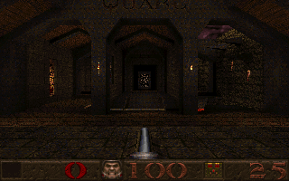 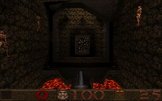 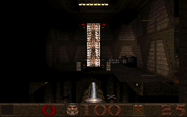 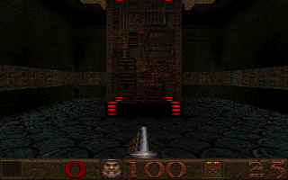 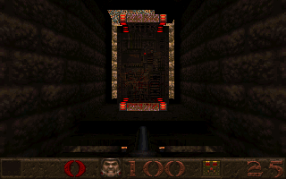

1. the hall of the skill doors
2. the crucified zombies twitching over the lava, the decoration the E1M5 test checks first
3. the slipgate to episode 1
4. the slipgate to episode 3
5. the slipgate to episode 4

The start map has no items, so these views were posed from the entity list: the zombies on the walls and the four episode gates. The gate to episode 2 is behind bars in the shareware version.

```bash
node scripts/screenshot.mjs start docs/skills    --single --fast
node scripts/screenshot.mjs start docs/crucified --at=856,840,60,90 --tics=4 --single --fast
node scripts/screenshot.mjs start docs/episode1  --at=-64,1250,130,90 --tics=4 --single --fast
node scripts/screenshot.mjs start docs/episode3  --at=1536,2830,255,90 --tics=4 --single --fast
node scripts/screenshot.mjs start docs/episode4  --at=1700,1728,-200,0 --tics=4 --single --fast
```

## E1M1, the Slipgate Complex

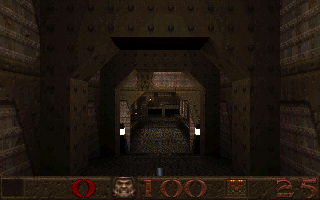 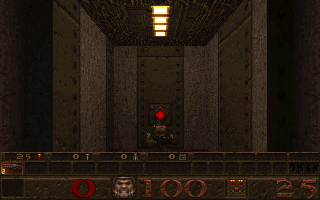 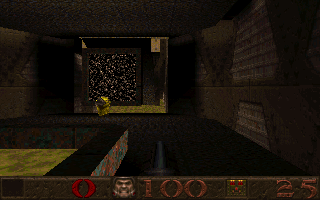 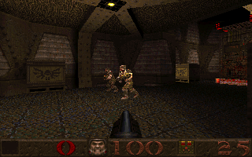 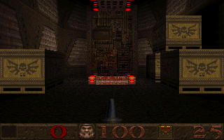

1. from the start
2. a grunt
3. the slime hall, its teleporter and the yellow armour
4. two grunts coming over the bridge, twelve tics after they spot the player
5. the exit slipgate

```bash
node scripts/screenshot.mjs e1m1 docs/screenshot --single --fast
node scripts/screenshot.mjs e1m1 docs/slime    --at=1392,824,-402,90  --tics=8  --single --fast
node scripts/screenshot.mjs e1m1 docs/grunts   --at=1150,1030,-250,330 --tics=12 --single --fast
node scripts/screenshot.mjs e1m1 docs/slipgate --at=1312,800,-240,270 --tics=10 --single --fast
```

## E1M2, Castle of the Damned

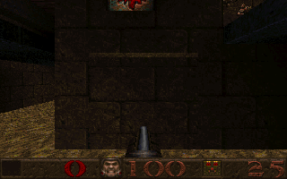 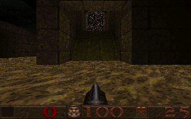 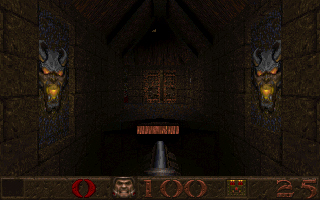 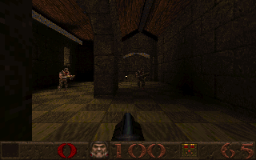

1. the drawbridge slab standing in the moat channel, from the near bank
2. the same spot four seconds later: stepping onto the bank has sunk the slab, and the moat can be waded (the E1M2 test)
3. the gold key between its two demon torches
4. grunts in the beamed hall

The bank in front of the slab is the trigger that lowers it, so the second frame needed no SQL, only time.

```bash
node scripts/screenshot.mjs e1m2 docs/bridgeup   --at=1400,-564,229,0 --tics=2  --single --fast
node scripts/screenshot.mjs e1m2 docs/bridgedown --at=1400,-564,229,0 --tics=80 --single --fast   # the bank is the trigger
node scripts/screenshot.mjs e1m2 docs/keyroom    --at=880,-300,470,270 --tics=8 --single --fast
node scripts/screenshot.mjs e1m2 docs/hall       --at=536,-1264,438,90 --tics=8 --single --fast
```

## E1M3, the Necropolis

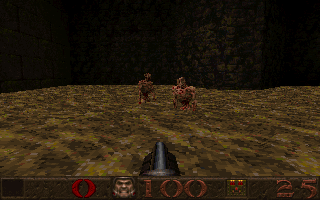 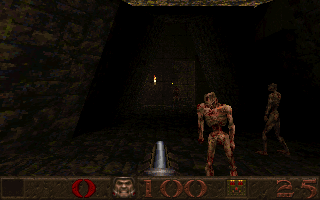 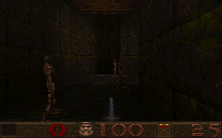

1. zombies up out of the pits, four seconds after the trap springs (the E1M3 test)
2. zombies in the arched hall
3. a zombie shambling down a corridor

The trap is the trigger the gold key lies on; the first frame fires it through SQL with the player standing between the key and the nearest pit.

```bash
node scripts/screenshot.mjs e1m3 docs/pits     --at=-900,-240,-330,90 --sql="UPDATE player SET pitch = 5; EXECUTE PROCEDURE trigger_fire((SELECT id FROM ents WHERE classname = 'trigger_once' AND target = 't83'), (SELECT ent_id FROM player))" --tics=80 --single --fast
node scripts/screenshot.mjs e1m3 docs/zombies  --at=-128,-824,-322,0 --tics=8 --single --fast
node scripts/screenshot.mjs e1m3 docs/corridor --at=1352,120,-130,0 --tics=8 --single --fast
```

## E1M4, the Grisly Grotto

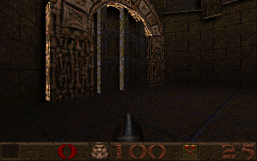 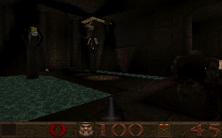 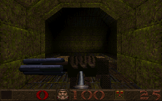 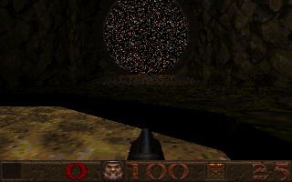

1. the carved gate
2. knights across the lake
3. the super nailgun in its chamber
4. the ledge with the secret slipgate to Ziggurat Vertigo, seen from the water, where the E1M4 test surfaces

The underwater door the test swims through was rendered too, shut and then open, but the lake bottom has no light and both frames came out black.

```bash
node scripts/screenshot.mjs e1m4 docs/arch     --at=-472,2080,1230,45 --tics=8 --single --fast
node scripts/screenshot.mjs e1m4 docs/lake     --at=1088,-784,846,135 --tics=8 --single --fast
node scripts/screenshot.mjs e1m4 docs/tunnel   --at=704,1408,542,270 --tics=8 --single --fast
node scripts/screenshot.mjs e1m4 docs/ledge    --at=1288,1350,845,90 --tics=4 --single --fast
```

## E1M5, Gloom Keep

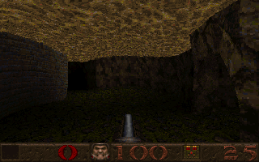 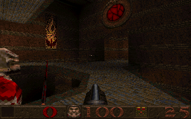 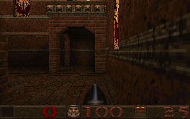 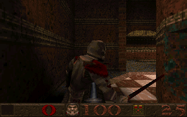 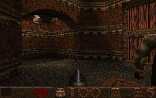

1. under the water of the flooded moat, where the E1M5 test holds its breath
2. the moat courtyard with its round window
3. the stained-glass hall
4. a knight on the checkered floor
5. an ogre at the wooden gate

```bash
node scripts/screenshot.mjs e1m5 docs/flooded  --at=-312,314,-12,0 --tics=4 --single --fast
node scripts/screenshot.mjs e1m5 docs/moat     --at=-792,1608,158,315 --tics=2 --single --fast
node scripts/screenshot.mjs e1m5 docs/glass    --at=128,1840,-18,180 --tics=8 --single --fast
node scripts/screenshot.mjs e1m5 docs/knight   --at=-1128,1344,162,180 --tics=8 --single --fast
node scripts/screenshot.mjs e1m5 docs/goldkey  --at=-760,2248,330,315 --tics=2 --single --fast
```

## E1M6, The Door To Chthon

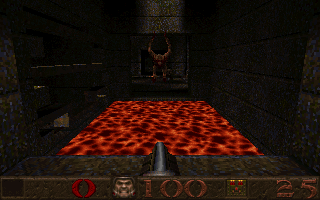 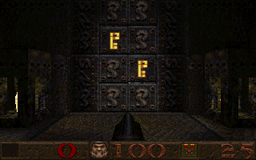 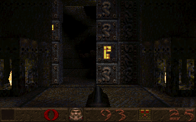 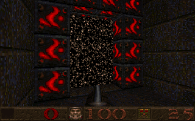 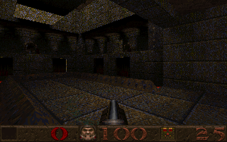 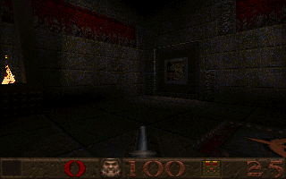

1. a second and a half after taking the gold runekey: the fiend that guards it is awake across the lava
2. the gold runekey doors, shut
3. the doors take the key and slide aside (the E1M6 test)
4. a slipgate between its red torches
5. the pillared hall
6. the banner hall

The hallway to the exit for E1M7 is held by a shambler who charges the moment the player appears, so that view is a shambler's back.

```bash
node scripts/screenshot.mjs e1m6 docs/runekey   --at=224,120,62,90 --sql="UPDATE player SET pitch = 10" --tics=30 --single --fast
node scripts/screenshot.mjs e1m6 docs/golddoors --at=250,704,31,0 --tics=4 --single --fast
node scripts/screenshot.mjs e1m6 docs/goldopen  --at=250,704,31,0 --sql="EXECUTE PROCEDURE door_fire(6, (SELECT ent_id FROM player))" --tics=40 --single --fast
node scripts/screenshot.mjs e1m6 docs/slipgate  --at=-472,136,110,250 --tics=8 --single --fast
node scripts/screenshot.mjs e1m6 docs/pillars   --at=-40,1184,-306,135 --tics=8 --single --fast
node scripts/screenshot.mjs e1m6 docs/banners   --at=672,152,30,135 --tics=8 --single --fast
```

## E1M7, the House of Chthon

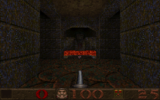 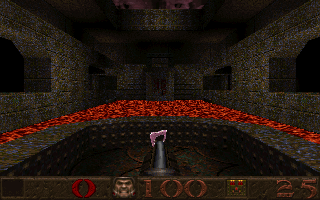 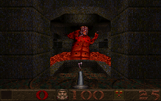 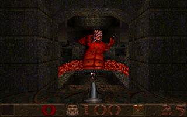 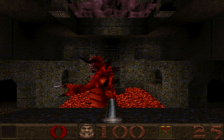 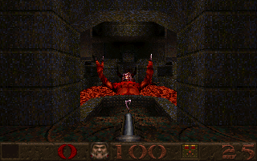

1. from the start
2. the rune on the floor of the hall
3. Chthon risen from the lava
4. Chthon winds up a lava ball, both lightning terminals raised
5. Chthon from the far end of the hall, where the lightning button is
6. eight tics after the third bolt: Chthon sinks back into the lava (the E1M7 test)

The death frame is staged in steps: wake Chthon and raise the terminals, wait six seconds, fire three bolts a few tics apart, wait eight tics. A second later the pit is empty.

```bash
node scripts/screenshot.mjs e1m7 docs/screenshot --single --fast
node scripts/screenshot.mjs e1m7 docs/rune     --at=-120,64,20,0 --tics=2 --single --fast
node scripts/screenshot.mjs e1m7 docs/chthon   --at=-300,64,56,0 --sql="EXECUTE PROCEDURE boss_awake((SELECT id FROM ents WHERE mtype = 'boss'))" --tics=70 --single --fast
node scripts/screenshot.mjs e1m7 docs/lavathrow --at=-300,64,56,0 --sql="EXECUTE PROCEDURE boss_awake(2); EXECUTE PROCEDURE button_fire(22, (SELECT ent_id FROM player)); EXECUTE PROCEDURE button_fire(24, (SELECT ent_id FROM player))" --tics=120 --single --fast
node scripts/screenshot.mjs e1m7 docs/behind   --at=824,64,180,180 --sql="EXECUTE PROCEDURE boss_awake(2)" --tics=70 --single --fast
node scripts/screenshot.mjs e1m7 docs/death    --at=-300,64,56,0 --sql="EXECUTE PROCEDURE boss_awake(2); EXECUTE PROCEDURE button_fire(22, (SELECT ent_id FROM player)); EXECUTE PROCEDURE button_fire(24, (SELECT ent_id FROM player))" --tics=120 --sql="EXECUTE PROCEDURE event_lightning_fire(15)" --tics=3 --sql="EXECUTE PROCEDURE event_lightning_fire(15)" --tics=3 --sql="EXECUTE PROCEDURE event_lightning_fire(15)" --tics=8 --single --fast
```

## E1M8, Ziggurat Vertigo

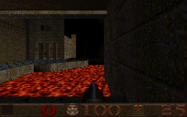 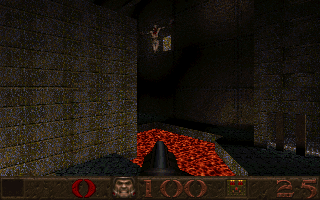 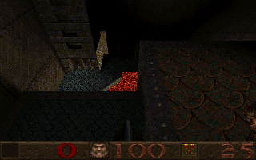 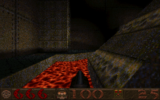 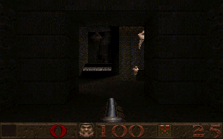 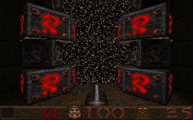

1. the lava hall at the bottom of the level
2. a scrag over the lava river
3. the view down from a jump that is still rising three seconds in: gravity here is an eighth of normal (the E1M8 test)
4. the lava channel by the pentagram
5. the silver key room, an ogre on the ledge above
6. the exit slipgate to E1M5

Ziggurat Vertigo is a dark level by design; the lava is the light in most of these.

```bash
node scripts/screenshot.mjs e1m8 docs/lavahall --at=992,-96,-706,270 --tics=8 --single --fast
node scripts/screenshot.mjs e1m8 docs/scrag    --at=96,-120,-594,315 --tics=8 --single --fast
node scripts/screenshot.mjs e1m8 docs/jump     --at=992,-96,-676,270 --sql="UPDATE ents SET vz = 300 WHERE id = (SELECT ent_id FROM player); UPDATE player SET pitch = 45" --tics=55 --single --fast
node scripts/screenshot.mjs e1m8 docs/pentagram --at=672,536,-706,0 --tics=8 --single --fast
node scripts/screenshot.mjs e1m8 docs/silverkey --at=672,152,38,270 --tics=8 --single --fast
node scripts/screenshot.mjs e1m8 docs/exit      --at=1400,-240,31,0 --tics=4 --single --fast
```

## The registered monsters

The enforcer, the hell knight, the vore, the spawn, the rotfish and Shub-Niggurath live in `pak1.pak`,
the registered half of Quake, which the shareware episode does not include: the game logic for all six
is in `sql/monsters.sql` and `npm run test:registered` runs them in E1M1 without their models, so there
is nothing of them to draw here. If you own Quake, put `pak1.pak` beside `pak0.pak` in `public/pak/`
(the page and the screenshot tool pick it up; the page's file picker also takes the two files together)
and these commands render each one, spawned a few steps ahead of the player and given a second to
notice him:

```bash
node scripts/screenshot.mjs e1m1 docs/enforcer   --sql="EXECUTE PROCEDURE spawn_monster('enforcer', 250)"    --tics=20 --single --fast
node scripts/screenshot.mjs e1m1 docs/hellknight --sql="EXECUTE PROCEDURE spawn_monster('hell_knight', 250)" --tics=20 --single --fast
node scripts/screenshot.mjs e1m1 docs/vore       --sql="EXECUTE PROCEDURE spawn_monster('shalrath', 300)"    --tics=20 --single --fast
node scripts/screenshot.mjs e1m1 docs/spawn      --sql="EXECUTE PROCEDURE spawn_monster('tarbaby', 200)"     --tics=10 --single --fast
node scripts/screenshot.mjs e1m1 docs/rotfish    --sql="EXECUTE PROCEDURE spawn_monster('fish', 150)"        --tics=10 --single --fast
node scripts/screenshot.mjs e1m1 docs/shub       --sql="EXECUTE PROCEDURE spawn_monster('oldone', 400)"      --tics=10 --single --fast
```

Without `pak1.pak` the commands still run and the frame shows E1M1 with an invisible monster in it,
which is also what the registered test sees.
