# Screenshots

Every frame here is the result of a query: the SQL ran in Firebird WASM under Node and the painter
drew the rows headlessly, with `scripts/screenshot.mjs`. The command block under each level reproduces
its pictures. `--at` places the player, `--sql` runs statements (wake a boss, fire a button or a
trigger), `--tics` lets the world run, in as many steps as a scene needs; `--gallery` renders a view
from every item spot in a level, which is how most of these spots were found:

```bash
node scripts/screenshot.mjs e1m8 docs/g --gallery --fast     # docs/g-e1m8-gallery-NN_<item>_<x>_<y>_<z>_<yaw>.png
```

## The start map

    

1. the hall of the skill doors
2. the crucified zombies twitching over the lava, the decoration the E1M5 test checks first
3. the slipgate to episode 1
4. the slipgate to episode 3
5. the slipgate to episode 4

The start map has no items, so these views were posed from the entity list: the zombies on the walls and the four episode gates. The gate to episode 2 is behind bars in the shareware version.

```bash
node scripts/screenshot.mjs start docs/skills    --single --fast
node scripts/screenshot.mjs start docs/crucified --at=856,840,60,90 --tics=4 --single --fast
node scripts/screenshot.mjs start docs/episode1  --at=-64,1250,130,90 --tics=4 --single --fast
node scripts/screenshot.mjs start docs/episode3  --at=1536,2830,255,90 --tics=4 --single --fast
node scripts/screenshot.mjs start docs/episode4  --at=1700,1728,-200,0 --tics=4 --single --fast
```

## E1M1, the Slipgate Complex

    

1. from the start
2. a grunt
3. the slime hall, its teleporter and the yellow armour
4. two grunts coming over the bridge, twelve tics after they spot the player
5. the exit slipgate

```bash
node scripts/screenshot.mjs e1m1 docs/screenshot --single --fast
node scripts/screenshot.mjs e1m1 docs/slime    --at=1392,824,-402,90  --tics=8  --single --fast
node scripts/screenshot.mjs e1m1 docs/grunts   --at=1150,1030,-250,330 --tics=12 --single --fast
node scripts/screenshot.mjs e1m1 docs/slipgate --at=1312,800,-240,270 --tics=10 --single --fast
```

## E1M2, Castle of the Damned

   

1. the drawbridge slab standing in the moat channel, from the near bank
2. the same spot four seconds later: stepping onto the bank has sunk the slab, and the moat can be waded (the E1M2 test)
3. the gold key between its two demon torches
4. grunts in the beamed hall

The bank in front of the slab is the trigger that lowers it, so the second frame needed no SQL, only time.

```bash
node scripts/screenshot.mjs e1m2 docs/bridgeup   --at=1400,-564,229,0 --tics=2  --single --fast
node scripts/screenshot.mjs e1m2 docs/bridgedown --at=1400,-564,229,0 --tics=80 --single --fast   # the bank is the trigger
node scripts/screenshot.mjs e1m2 docs/keyroom    --at=880,-300,470,270 --tics=8 --single --fast
node scripts/screenshot.mjs e1m2 docs/hall       --at=536,-1264,438,90 --tics=8 --single --fast
```

## E1M3, the Necropolis

  

1. zombies up out of the pits, four seconds after the trap springs (the E1M3 test)
2. zombies in the arched hall
3. a zombie shambling down a corridor

The trap is the trigger the gold key lies on; the first frame fires it through SQL with the player standing between the key and the nearest pit.

```bash
node scripts/screenshot.mjs e1m3 docs/pits     --at=-900,-240,-330,90 --sql="UPDATE player SET pitch = 5; EXECUTE PROCEDURE trigger_fire((SELECT id FROM ents WHERE classname = 'trigger_once' AND target = 't83'), (SELECT ent_id FROM player))" --tics=80 --single --fast
node scripts/screenshot.mjs e1m3 docs/zombies  --at=-128,-824,-322,0 --tics=8 --single --fast
node scripts/screenshot.mjs e1m3 docs/corridor --at=1352,120,-130,0 --tics=8 --single --fast
```

## E1M4, the Grisly Grotto

   

1. the carved gate
2. knights across the lake
3. the super nailgun in its chamber
4. the ledge with the secret slipgate to Ziggurat Vertigo, seen from the water, where the E1M4 test surfaces

The underwater door the test swims through was rendered too, shut and then open, but the lake bottom has no light and both frames came out black.

```bash
node scripts/screenshot.mjs e1m4 docs/arch     --at=-472,2080,1230,45 --tics=8 --single --fast
node scripts/screenshot.mjs e1m4 docs/lake     --at=1088,-784,846,135 --tics=8 --single --fast
node scripts/screenshot.mjs e1m4 docs/tunnel   --at=704,1408,542,270 --tics=8 --single --fast
node scripts/screenshot.mjs e1m4 docs/ledge    --at=1288,1350,845,90 --tics=4 --single --fast
```

## E1M5, Gloom Keep

    

1. under the water of the flooded moat, where the E1M5 test holds its breath
2. the moat courtyard with its round window
3. the stained-glass hall
4. a knight on the checkered floor
5. an ogre at the wooden gate

```bash
node scripts/screenshot.mjs e1m5 docs/flooded  --at=-312,314,-12,0 --tics=4 --single --fast
node scripts/screenshot.mjs e1m5 docs/moat     --at=-792,1608,158,315 --tics=2 --single --fast
node scripts/screenshot.mjs e1m5 docs/glass    --at=128,1840,-18,180 --tics=8 --single --fast
node scripts/screenshot.mjs e1m5 docs/knight   --at=-1128,1344,162,180 --tics=8 --single --fast
node scripts/screenshot.mjs e1m5 docs/goldkey  --at=-760,2248,330,315 --tics=2 --single --fast
```

## E1M6, The Door To Chthon

     

1. a second and a half after taking the gold runekey: the fiend that guards it is awake across the lava
2. the gold runekey doors, shut
3. the doors take the key and slide aside (the E1M6 test)
4. a slipgate between its red torches
5. the pillared hall
6. the banner hall

The hallway to the exit for E1M7 is held by a shambler who charges the moment the player appears, so that view is a shambler's back.

```bash
node scripts/screenshot.mjs e1m6 docs/runekey   --at=224,120,62,90 --sql="UPDATE player SET pitch = 10" --tics=30 --single --fast
node scripts/screenshot.mjs e1m6 docs/golddoors --at=250,704,31,0 --tics=4 --single --fast
node scripts/screenshot.mjs e1m6 docs/goldopen  --at=250,704,31,0 --sql="EXECUTE PROCEDURE door_fire(6, (SELECT ent_id FROM player))" --tics=40 --single --fast
node scripts/screenshot.mjs e1m6 docs/slipgate  --at=-472,136,110,250 --tics=8 --single --fast
node scripts/screenshot.mjs e1m6 docs/pillars   --at=-40,1184,-306,135 --tics=8 --single --fast
node scripts/screenshot.mjs e1m6 docs/banners   --at=672,152,30,135 --tics=8 --single --fast
```

## E1M7, the House of Chthon

     

1. from the start
2. the rune on the floor of the hall
3. Chthon risen from the lava
4. Chthon winds up a lava ball, both lightning terminals raised
5. Chthon from the far end of the hall, where the lightning button is
6. eight tics after the third bolt: Chthon sinks back into the lava (the E1M7 test)

The death frame is staged in steps: wake Chthon and raise the terminals, wait six seconds, fire three bolts a few tics apart, wait eight tics. A second later the pit is empty.

```bash
node scripts/screenshot.mjs e1m7 docs/screenshot --single --fast
node scripts/screenshot.mjs e1m7 docs/rune     --at=-120,64,20,0 --tics=2 --single --fast
node scripts/screenshot.mjs e1m7 docs/chthon   --at=-300,64,56,0 --sql="EXECUTE PROCEDURE boss_awake((SELECT id FROM ents WHERE mtype = 'boss'))" --tics=70 --single --fast
node scripts/screenshot.mjs e1m7 docs/lavathrow --at=-300,64,56,0 --sql="EXECUTE PROCEDURE boss_awake(2); EXECUTE PROCEDURE button_fire(22, (SELECT ent_id FROM player)); EXECUTE PROCEDURE button_fire(24, (SELECT ent_id FROM player))" --tics=120 --single --fast
node scripts/screenshot.mjs e1m7 docs/behind   --at=824,64,180,180 --sql="EXECUTE PROCEDURE boss_awake(2)" --tics=70 --single --fast
node scripts/screenshot.mjs e1m7 docs/death    --at=-300,64,56,0 --sql="EXECUTE PROCEDURE boss_awake(2); EXECUTE PROCEDURE button_fire(22, (SELECT ent_id FROM player)); EXECUTE PROCEDURE button_fire(24, (SELECT ent_id FROM player))" --tics=120 --sql="EXECUTE PROCEDURE event_lightning_fire(15)" --tics=3 --sql="EXECUTE PROCEDURE event_lightning_fire(15)" --tics=3 --sql="EXECUTE PROCEDURE event_lightning_fire(15)" --tics=8 --single --fast
```

## E1M8, Ziggurat Vertigo

     

1. the lava hall at the bottom of the level
2. a scrag over the lava river
3. the view down from a jump that is still rising three seconds in: gravity here is an eighth of normal (the E1M8 test)
4. the lava channel by the pentagram
5. the silver key room, an ogre on the ledge above
6. the exit slipgate to E1M5

Ziggurat Vertigo is a dark level by design; the lava is the light in most of these.

```bash
node scripts/screenshot.mjs e1m8 docs/lavahall --at=992,-96,-706,270 --tics=8 --single --fast
node scripts/screenshot.mjs e1m8 docs/scrag    --at=96,-120,-594,315 --tics=8 --single --fast
node scripts/screenshot.mjs e1m8 docs/jump     --at=992,-96,-676,270 --sql="UPDATE ents SET vz = 300 WHERE id = (SELECT ent_id FROM player); UPDATE player SET pitch = 45" --tics=55 --single --fast
node scripts/screenshot.mjs e1m8 docs/pentagram --at=672,536,-706,0 --tics=8 --single --fast
node scripts/screenshot.mjs e1m8 docs/silverkey --at=672,152,38,270 --tics=8 --single --fast
node scripts/screenshot.mjs e1m8 docs/exit      --at=1400,-240,31,0 --tics=4 --single --fast
```

## The registered monsters

The enforcer, the hell knight, the vore, the spawn, the rotfish and Shub-Niggurath live in `pak1.pak`,
the registered half of Quake, which the shareware episode does not include; `npm run test:registered`
runs their game logic in E1M1 without their models. With a registered `pak1.pak` beside `pak0.pak` in
`public/pak/` (the page and the screenshot tool pick it up; the page's file picker also takes the two
files together) they can be drawn: here each is spawned a few steps ahead of the player in E1M1's slime
hall and given a moment to notice him.

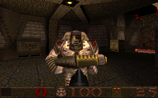 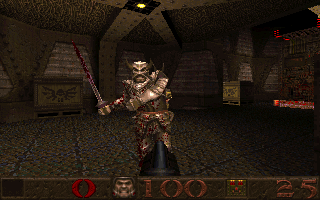 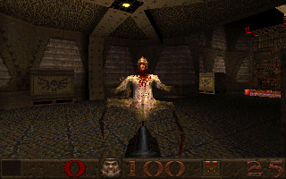 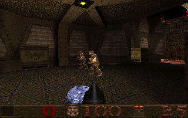 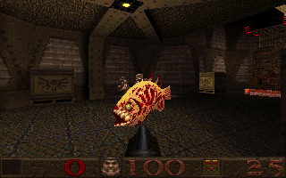 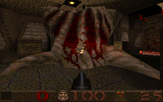

1. an enforcer
2. a hell knight, sword raised
3. a vore
4. a spawn: the black blob bounding at the player
5. a rotfish, flopping out of its water
6. Shub-Niggurath, filling the hall

```bash
node scripts/screenshot.mjs e1m1 docs/enforcer    --at=1150,1030,-250,330 --sql="SELECT * FROM spawn_monster('enforcer', 160)"    --tics=16 --single --fast
node scripts/screenshot.mjs e1m1 docs/hell_knight --at=1150,1030,-250,330 --sql="SELECT * FROM spawn_monster('hell_knight', 160)" --tics=16 --single --fast
node scripts/screenshot.mjs e1m1 docs/shalrath    --at=1150,1030,-250,330 --sql="SELECT * FROM spawn_monster('shalrath', 130)"    --tics=10 --single --fast
node scripts/screenshot.mjs e1m1 docs/tarbaby     --at=1150,1030,-250,330 --sql="SELECT * FROM spawn_monster('tarbaby', 90)"      --tics=3  --single --fast
node scripts/screenshot.mjs e1m1 docs/fish        --at=1150,1030,-250,330 --sql="SELECT * FROM spawn_monster('fish', 100)"        --tics=6  --single --fast
node scripts/screenshot.mjs e1m1 docs/oldone      --at=1150,1030,-250,330 --sql="SELECT * FROM spawn_monster('oldone', 300)"      --tics=8  --single --fast
```

`spawn_monster` is a selectable procedure, so it is run with `SELECT`; the tool runs a `--sql`
statement that starts with `SELECT` as a query and anything else as a statement. Without `pak1.pak`
the commands still run and the frame shows the hall with an invisible monster in it, which is also
what the registered test sees.

### With LibreQuake's pak1.pak

[LibreQuake](https://github.com/lavenderdotpet/LibreQuake) ships a free `pak1.pak` with its own
models for the same six monsters (`npm run fetch-librequake` puts it in `public/pak/lq1/`). The
same commands with `PAK1=public/pak/lq1/pak1.pak` draw them in the shareware E1M1:

 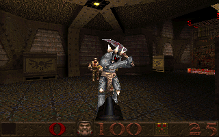 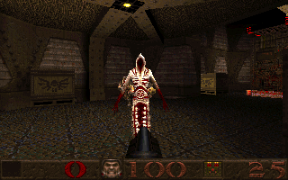 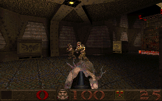 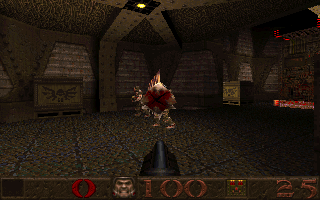 

```bash
PAK1=public/pak/lq1/pak1.pak node scripts/screenshot.mjs e1m1 docs/lq-enforcer --at=1150,1030,-250,330 --sql="SELECT * FROM spawn_monster('enforcer', 160)" --tics=16 --single --fast
```

## LibreQuake

LibreQuake's own levels, from its `pak0.pak` (`PAK=public/pak/lq1/pak0.pak PAK1=public/pak/lq1/pak1.pak`):
the start map, and the first level forty tics in.

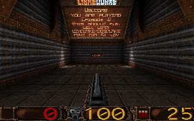 

```bash
PAK=public/pak/lq1/pak0.pak PAK1=public/pak/lq1/pak1.pak node scripts/screenshot.mjs start   docs/librequake --single --fast
PAK=public/pak/lq1/pak0.pak PAK1=public/pak/lq1/pak1.pak node scripts/screenshot.mjs lq_e0m1 docs/librequake --tics=40 --single --fast
```

## E2M1, the Installation

The first level of the registered game, from the same `pak1.pak`.

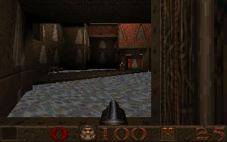 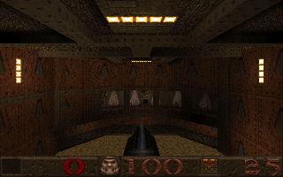 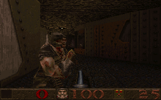 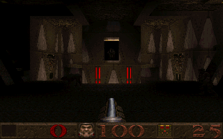 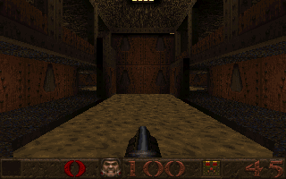 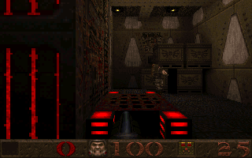

1. the flooded entrance hall, a grunt on the far side
2. the control room under its yellow lights
3. an enforcer in the corridor, firing
4. the gold key room with its red lights
5. the pillared hall
6. the exit room, its red machinery and the way to E2M2

```bash
node scripts/screenshot.mjs e2m1 docs/entrance --at=1632,-288,-2,90 --tics=8 --single --fast
node scripts/screenshot.mjs e2m1 docs/control  --at=944,1064,158,180 --tics=8 --single --fast
node scripts/screenshot.mjs e2m1 docs/enforcer --at=272,560,30,90 --tics=8 --single --fast
node scripts/screenshot.mjs e2m1 docs/goldkey  --at=1848,1320,78,270 --tics=8 --single --fast
node scripts/screenshot.mjs e2m1 docs/pillars  --at=576,216,-66,90 --tics=8 --single --fast
node scripts/screenshot.mjs e2m1 docs/exitroom --at=60,-24,0,180 --tics=4 --single --fast
```

## E2M2, the Ogre Citadel

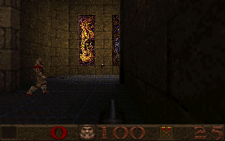 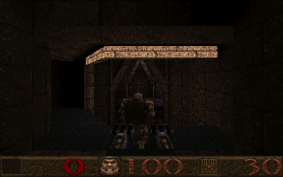 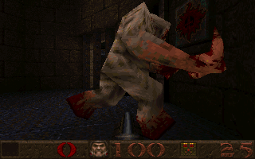 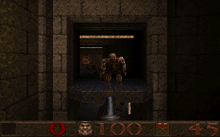 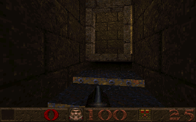 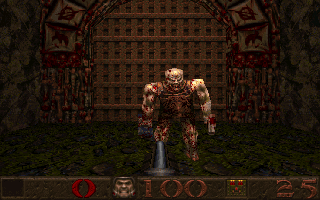

1. a knight in the stained-glass hall
2. an ogre at the gate under its lit lintel
3. the citadel's shambler
4. an ogre in the window
5. the gold key's walkway over the pit
6. an ogre before the red-bannered exit gate to E2M3

```bash
node scripts/screenshot.mjs e2m2 docs/glass    --at=80,480,30,0 --tics=8 --single --fast
node scripts/screenshot.mjs e2m2 docs/gate     --at=152,1608,166,270 --tics=8 --single --fast
node scripts/screenshot.mjs e2m2 docs/shambler --at=-296,208,-34,75 --tics=6 --single --fast
node scripts/screenshot.mjs e2m2 docs/window   --at=-208,992,134,270 --tics=8 --single --fast
node scripts/screenshot.mjs e2m2 docs/walkway  --at=-552,192,-34,225 --tics=8 --single --fast
node scripts/screenshot.mjs e2m2 docs/exitogre --at=1880,-180,200,0 --tics=6 --single --fast
```

## E2M3, the Crypt of Decay

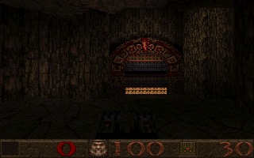 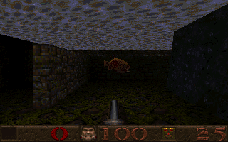 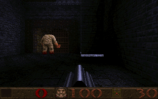 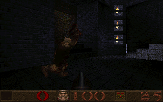 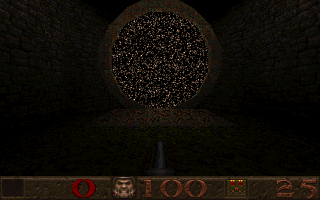

1. the red carved doorway at the end of the hall
2. a rotfish under the surface of the flooded crypt
3. a shambler at the grated gate
4. an ogre leaping by the window lights
5. the secret slipgate to the Underearth, E2M7

```bash
node scripts/screenshot.mjs e2m3 docs/altar      --at=184,-1520,-242,0 --tics=8 --single --fast
node scripts/screenshot.mjs e2m3 docs/rotfish    --at=-56,576,-354,90 --tics=8 --single --fast
node scripts/screenshot.mjs e2m3 docs/grate      --at=-1256,1448,-50,270 --tics=8 --single --fast
node scripts/screenshot.mjs e2m3 docs/lights     --at=-800,1504,-50,315 --tics=8 --single --fast
node scripts/screenshot.mjs e2m3 docs/secretgate --at=880,1776,-220,0 --tics=4 --single --fast
```

## E2M4, the Ebon Fortress

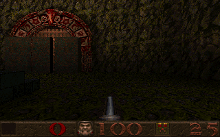 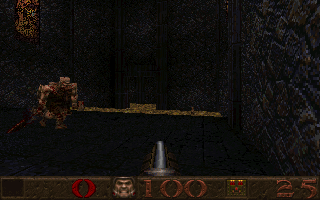 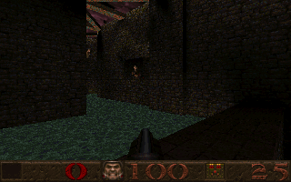 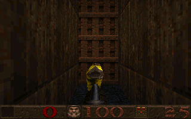 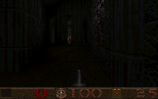

1. the red carved gate in the mossy wall
2. a hell knight, sword drawn
3. the moat courtyard, an ogre in the window above
4. the fortress gate, the yellow armour before it
5. the stained-glass hall

```bash
node scripts/screenshot.mjs e2m4 docs/redgate    --at=-1104,1968,158,180 --tics=8 --single --fast
node scripts/screenshot.mjs e2m4 docs/hellknight --at=752,1504,62,15 --tics=10 --single --fast
node scripts/screenshot.mjs e2m4 docs/moat       --at=680,2200,302,45 --tics=8 --single --fast
node scripts/screenshot.mjs e2m4 docs/fortgate   --at=2216,2184,-2,270 --tics=8 --single --fast
node scripts/screenshot.mjs e2m4 docs/glass      --at=1024,1408,182,180 --tics=8 --single --fast
```

## E2M5, the Wizard's Manse

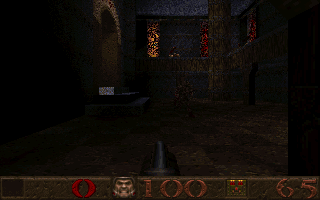 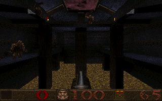 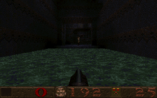 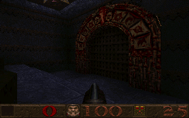 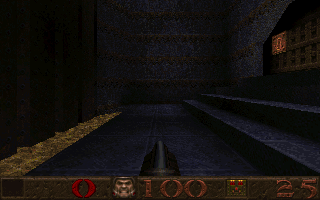 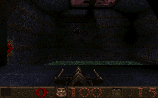

1. an ogre under the manse's orange windows
2. a fiend leaping in the pillared hall, an ogre below
3. the water pool and the doorway beyond it
4. the red carved gate
5. the great hall and its steps
6. the thunderbolt, picked up over the flooded hall

```bash
node scripts/screenshot.mjs e2m5 docs/windows     --at=704,704,-18,90 --tics=8 --single --fast
node scripts/screenshot.mjs e2m5 docs/fiend       --at=112,1408,30,90 --tics=8 --single --fast
node scripts/screenshot.mjs e2m5 docs/pool        --at=-600,2032,-106,270 --tics=8 --single --fast
node scripts/screenshot.mjs e2m5 docs/redgates    --at=-1024,3152,-42,225 --tics=8 --single --fast
node scripts/screenshot.mjs e2m5 docs/greathall   --at=-520,3160,-106,270 --tics=8 --single --fast
node scripts/screenshot.mjs e2m5 docs/thunderbolt --at=-672,1392,-74,270 --tics=8 --single --fast
```

## E2M6, the Dismal Oubliette

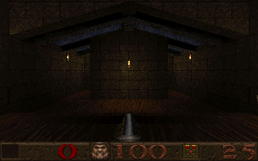 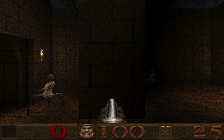 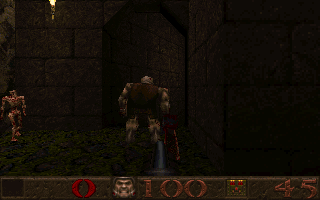 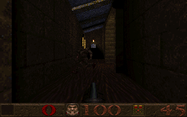 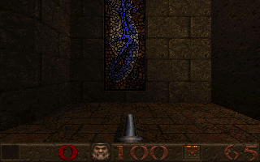

1. the vaulted hall at the start
2. the two vores that guard the episode's rune, at the bottom of the oubliette
3. an ogre and a zombie at the doorway of the slime hall
4. a hell knight in the hallway under the blue window
5. the blue stained-glass window

```bash
node scripts/screenshot.mjs e2m6 docs/vault      --single --fast
node scripts/screenshot.mjs e2m6 docs/vores      --at=-608,700,-978,270 --tics=6 --single --fast
node scripts/screenshot.mjs e2m6 docs/slimehall  --at=1904,-224,-402,0 --tics=8 --single --fast
node scripts/screenshot.mjs e2m6 docs/hellknight --at=1024,792,-482,270 --tics=8 --single --fast
node scripts/screenshot.mjs e2m6 docs/bluewindow --at=1240,1280,-994,270 --tics=8 --single --fast
```

## E2M7, the Underearth

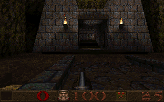 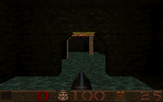 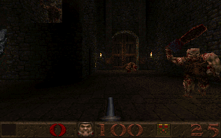 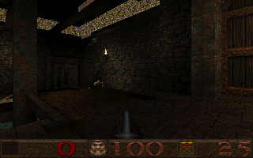 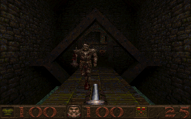 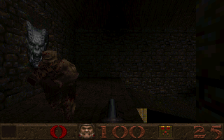

1. the temple front at the start of the episode's secret level
2. the flooded hall and its lit arch
3. a hell knight and an ogre in the gate hall
4. the skylit hall
5. a hell knight coming over the covered bridge
6. a scrag over an ogre's shoulder

```bash
node scripts/screenshot.mjs e2m7 docs/temple     --at=1084,-928,-74,90 --tics=8 --single --fast
node scripts/screenshot.mjs e2m7 docs/flooded    --at=1024,492,-226,90 --tics=8 --single --fast
node scripts/screenshot.mjs e2m7 docs/hellknight --at=1800,424,-102,180 --tics=8 --single --fast
node scripts/screenshot.mjs e2m7 docs/skylights  --at=920,520,-102,45 --tics=8 --single --fast
node scripts/screenshot.mjs e2m7 docs/bridge     --at=784,1816,-210,180 --tics=8 --single --fast
node scripts/screenshot.mjs e2m7 docs/scrag      --at=1200,1992,-162,270 --tics=8 --single --fast
```

## E3M1, Termination Central

     

1. the walkways over the slime
2. a grunt by the caged lift
3. the skylit hall, grunts at the far end
4. two enforcers on the ledge
5. the gold key room, over the lower hall
6. an enforcer on the red grating before the exit to E3M2

```bash
node scripts/screenshot.mjs e3m1 docs/slime    --at=1072,952,-242,315 --tics=8 --single --fast
node scripts/screenshot.mjs e3m1 docs/bridge   --at=1952,256,-82,315 --tics=8 --single --fast
node scripts/screenshot.mjs e3m1 docs/console  --at=304,576,-130,0 --tics=8 --single --fast
node scripts/screenshot.mjs e3m1 docs/enforcer --at=-368,144,-130,90 --tics=8 --single --fast
node scripts/screenshot.mjs e3m1 docs/keyroom  --at=-160,-752,-2,180 --tics=6 --single --fast
node scripts/screenshot.mjs e3m1 docs/exitgate --at=2340,-420,0,270 --tics=4 --single --fast
```

## E3M2, the Vaults of Zin

     

1. the crosses standing on the lava, between the torches
2. the lava channel running to the altar
3. an ogre and a fiend under the open sky of the upper court
4. a zombie before the grid door
5. the doorway under the Quake banner
6. the exit slipgate to E3M3, among its rune blocks

```bash
node scripts/screenshot.mjs e3m2 docs/banner    --at=-416,496,30,270 --tics=8 --single --fast
node scripts/screenshot.mjs e3m2 docs/lavaaltar --at=-72,-1216,-258,0 --tics=8 --single --fast
node scripts/screenshot.mjs e3m2 docs/pinksky   --at=32,-888,190,45 --tics=8 --single --fast
node scripts/screenshot.mjs e3m2 docs/zombie    --at=1008,8,-178,270 --tics=8 --single --fast
node scripts/screenshot.mjs e3m2 docs/lavawalk  --at=256,-1536,-258,0 --tics=8 --single --fast
node scripts/screenshot.mjs e3m2 docs/exitgate  --at=1700,496,47,0 --tics=4 --single --fast
```

## E3M3, the Tomb of Terror

     

1. the tomb at the start, its steps and crosses
2. the hall of crosses, from the blue lights of the entrance
3. the lava hall under its bridges, a scrag overhead
4. a fiend charging between the crosses
5. an ogre by the rune blocks
6. the exit slipgate to E3M4

```bash
node scripts/screenshot.mjs e3m3 docs/tomb     --single --fast
node scripts/screenshot.mjs e3m3 docs/crosses  --at=712,-120,30,270 --tics=8 --single --fast
node scripts/screenshot.mjs e3m3 docs/lavahall --at=-1080,328,174,315 --tics=8 --single --fast
node scripts/screenshot.mjs e3m3 docs/fiend    --at=880,-256,30,0 --tics=8 --single --fast
node scripts/screenshot.mjs e3m3 docs/ogre     --at=1632,280,-98,90 --tics=8 --single --fast
node scripts/screenshot.mjs e3m3 docs/exitgate --at=1700,400,-97,0 --tics=4 --single --fast
```

## QuakeC mode

E1M1 spawned by the original `progs.dat` and run by `qc_server_frame` on the engine's physics: the grunts
and the health boxes on the bridge were placed and dropped to the floor by their own QuakeC, and the
status bar reads the QuakeC player's fields. A second later, with `checkclient` and `movetogoal`, one
of them has seen the player and run at him, aiming.

 

1. the grunts and health boxes, placed and dropped by their QuakeC
2. one second later: a grunt has seen the player and run at him, aiming

```bash
node scripts/screenshot.mjs e1m1 docs/qcvm    --qc --at=1150,1030,-250,330 --tics=4  --single --fast
node scripts/screenshot.mjs e1m1 docs/qcvm-ai --qc --at=1150,1030,-250,330 --tics=20 --single --fast
```

## The intermission and the finale

The end of a level, as Quake's status bar code draws it (`Sbar_IntermissionOverlay`): the time,
the secrets and the kills over the view from one of the level's `info_intermission` cameras, until
fire: the PSQL game's `changelevel` moves the view there as `execute_changelevel` does, and in QuakeC
mode progs.dat does it itself and sends `svc_intermission`. After E1M7, `ExitIntermission` sends `svc_cdtrack` and `svc_finale`, whose text the page
types out at eight characters a second under `gfx/finale.lmp`.

 

1. E1M1 completed: the stats over an intermission camera's view (one of E1M1's, at random)
2. after E1M7, in QuakeC mode: the finale's text (here all of it) over the intermission camera's view

```bash
node scripts/screenshot.mjs e1m1 docs/intermission --tics=60 --sql="EXECUTE PROCEDURE changelevel((SELECT FIRST 1 id FROM ents WHERE classname = 'trigger_changelevel'))" --single --fast
node scripts/screenshot.mjs e1m7 docs/finale --qc --tics=20 --sql="EXECUTE PROCEDURE qc_sf(0, qc_fdef('model'), qc_newstr('maps/e1m7.bsp')); EXECUTE PROCEDURE qc_run('execute_changelevel', 0)" --tics=4 --sql="EXECUTE PROCEDURE qc_run('ExitIntermission', 1)" --tics=2 --single --fast
```

## Dynamic lights

The start of E1M1 three ways: unlit, with a rocket flying down the corridor (the model's `EF_ROCKET`
light, 200 units), and with an explosion going off ahead (350 units). The faces a light reaches are
rebuilt for the frame with the light added to their lightmap, as Quake's `R_AddDynamicLights` does;
the shotgun in hand takes the light too.

  

1. no dynamic light
2. a rocket 150 units down the corridor
3. an explosion 150 units ahead, at its brightest

```bash
node scripts/screenshot.mjs e1m1 docs/dlight-off    --tics=2 --single --fast
node scripts/screenshot.mjs e1m1 docs/dlight-rocket --tics=2 --sql="EXECUTE PROCEDURE launch_rocket((SELECT ent_id FROM player), 480, -320, 110, 0, 1, 0, 1000, 100, 'progs/missile.mdl')" --tics=3 --single --fast
node scripts/screenshot.mjs e1m1 docs/dlight-boom   --tics=2 --explosion=480,-200,70 --single --fast
```
